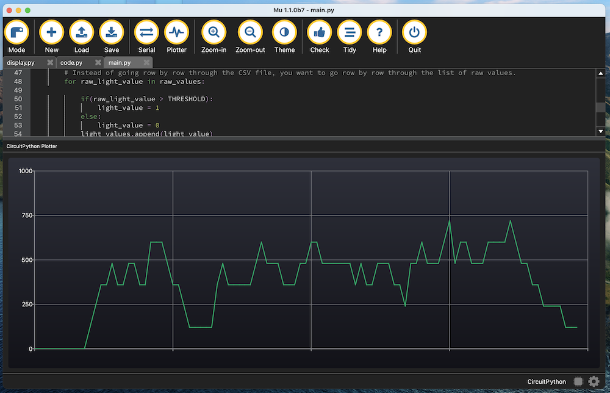
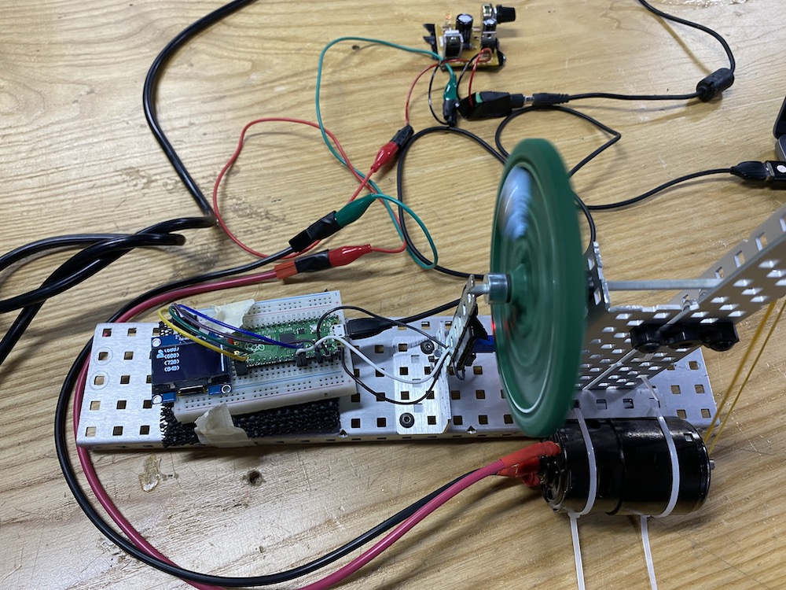
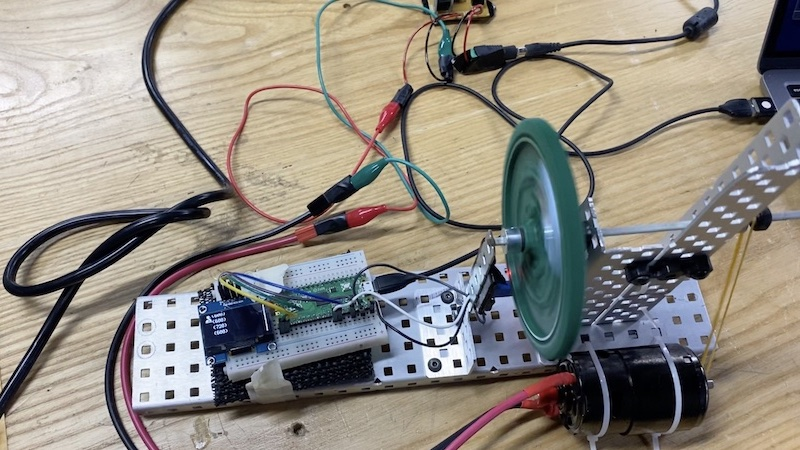
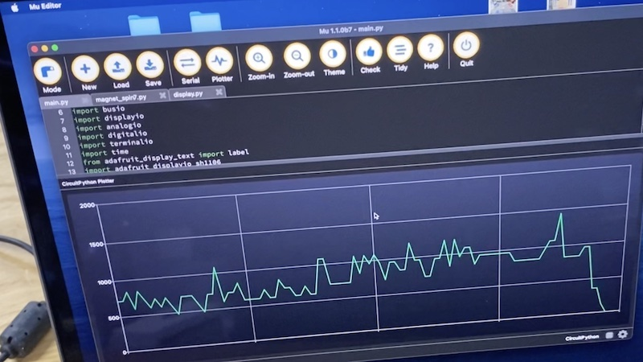

# RPM meter with OLED Display

Done in Advanced Automation 2021-2022 at SSIS by Vannak. That's how it looks:



## Driven by an external motor - June 4th, 2022






## Code

``` py
# https://github.com/Vlak23/magnet-spinny-thing
# Version 3.0

import board
import analogio
import digitalio
import time


# Set up light sensor
light = analogio.AnalogIn(board.A1)

SAMPLE_PERIOD = 0.001 # seconds
SAMPLE_SIZE = 500 # number of measurements to analyze at a time


# Set up lists to use for analysis
raw_values = [0]*SAMPLE_SIZE
light_values = [0]*SAMPLE_SIZE
num_transitions = 0
time_of_rotation = 0.0
# This is a calibration step to figure out what threshold value to use.
# Press the button A value when the light sensor is dark
THRESHOLD = 53000

current_time = 0.0
elapsed_time = 0
start_time = time.monotonic()
stop_collecting = False
old_pulsetime = 0

# This starts the data collection loop.
while not stop_collecting:


    # Read the raw light value from the sensor
    raw_light = light.value
    # Add the light value to the list of raw values
    raw_values.append(raw_light)

    # Once enough data points have been collected, process the list of raw_values.

    if(len(raw_values)>= SAMPLE_SIZE):

        # Build a list  of thresholded values
        # When your code is working in Replit on your sample CSV, this is where you want to put your algorithm for processing.
        # Instead of going row by row through the CSV file, you want to go row by row through the list of raw values.
        for raw_light_value in raw_values:

            if(raw_light_value > THRESHOLD):
                light_value = 1
            else:
                light_value = 0
            light_values.append(light_value)

        # Go through the thresholded data and change the number of transitions whenever the values go from 0 to 1.
        for i in range(len(light_values)-1):
            if(light_values[i] == 0 and light_values[i+1] == 1):
                current_time = time.monotonic()
                time_of_rotation = current_time - old_pulsetime
                old_pulsetime = current_time
                num_transitions += 1
        RPM = num_transitions * 2 * 60
        #     if(time_of_rotation > 0):
#                 RPM = 60/time_of_rotation
#             else:
#                 RPM = 0
        num_transitions = 0
        # Update the elapsed time based on how much time has gone by, and then print the data
        elapsed_time += current_time - start_time
        #print("{0},{1}".format(elapsed_time,RPM))
        print("({0})".format(RPM))

        # Reset the lists of data for the next sample period.
        start_time = current_time
        raw_values = []
        light_values = []


    time.sleep(SAMPLE_PERIOD)
```
